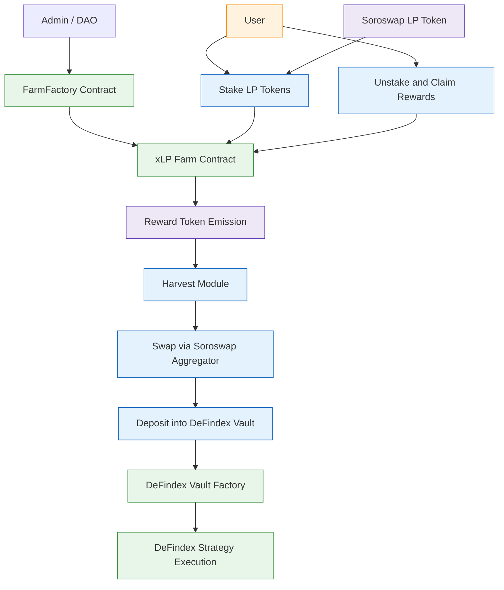

Thanks for the nudge. Here's your **full updated README** — rewritten for clarity, persuasion, and alignment with your new **“liquidity loyalty layer”** narrative, while keeping technical accuracy.

---

## 🪙 xLP Farm Protocol

**Turn short-term farming into long-term loyalty.**

`xLP Farm Protocol` is a plug-and-play liquidity loyalty layer built on **Soroswap** and **DeFindex**.
It enables any DAO or project to launch programmable staking farms for **Soroswap LP tokens**, with automated rewards, harvesting, and compounding into **DeFindex yield strategies**.

Users stake LP tokens once — rewards are earned on-chain, auto-harvested via the **Soroswap Aggregator**, and reinvested into DeFindex vaults for continuous yield.
Each farm is deployed via a permissionless factory contract with customizable emissions, boosts, and lockups.

By converting short-term incentives into long-term growth, xLP helps protocols retain TVL and reward loyal liquidity providers across the Stellar DeFi stack.

---

## 🔧 Features

### 🔹 **Custom LP Farming Campaigns**

Projects can launch fully programmable farms for any **Soroswap LP pair** using a factory contract. Set:

* Reward token(s)
* Emission rate & schedule
* Campaign duration
* Optional boosts, lockups, or vesting

### 🔹 **On-Chain Reward Distribution**

LPs earn ERC-20 rewards in real time via transparent on-chain emissions. No off-chain admin needed.

### 🔹 **Auto-Harvesting & Swapping**

Rewards are automatically harvested and swapped via the **Soroswap Aggregator**, requiring no manual claiming or gas actions by users.

### 🔹 **DeFindex Vault Integration**

Swapped rewards are deposited into **DeFindex smart vaults**, unlocking compounding strategies such as lending, LP farming, or real-world asset exposure — maximizing passive returns.

### 🔹 **Factory-Based Deployment**

Each farm is deployed as an isolated contract, enabling **modularity**, **security**, and **scalability** across multiple LP pairs and campaigns.

### 🔹 **Loyalty-Driven Liquidity**

xLP incentivizes LPs to **stay** rather than chase temporary rewards. This leads to deeper, more sustainable liquidity across both Soroswap and DeFindex.

---

##  Architecture

---

##  System Components

* **FarmFactory Contract**
  Deploys new farms with custom parameters (reward token, emissions, duration, etc.)

* **xLP Farm Contract**
  Handles LP staking, reward emissions, and coordinating harvest logic

* **Harvest Module**
  Automatically harvests rewards and triggers the compounding flow

* **Soroswap Aggregator**
  Swaps reward tokens into the desired token for reinvestment

* **DeFindex Vaults**
  Smart vaults that execute compounding strategies for passive growth

---
